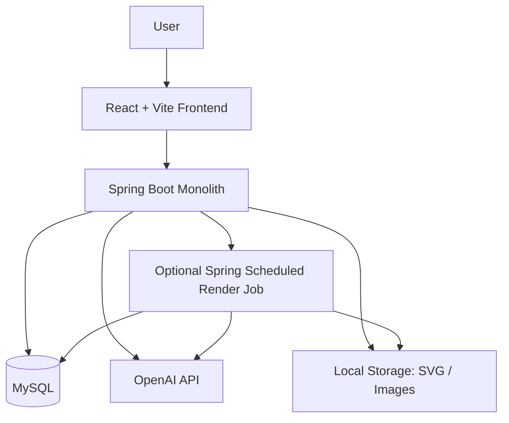

# ArchitectAI

AI-powered Vietnamese housing floorplan generator.

This README is intentionally MVP-first. The goal is to help one developer ship a working demo in 7 days, not design a future SaaS platform.

## 1. Project Overview

ArchitectAI turns natural-language Vietnamese housing requirements into a simple generated floorplan.

The app should:

1. Accept a user requirement.
2. Use AI to extract a structured `DesignBrief`.
3. Validate basic Vietnamese housing rules in Java.
4. Generate a simple `LayoutPlan`.
5. Generate deterministic floorplan geometry in Java.
6. Render an SVG floorplan.
7. Show a basic 3D preview in the frontend.
8. Optionally generate an AI render image.

The system is a monolith:

- One Spring Boot backend.
- One React + Vite frontend.
- One MySQL database.
- OpenAI API for structured extraction and optional render image generation.

## 2. MVP Scope

Included in the MVP:

- Natural-language requirement input.
- AI-extracted `DesignBrief` JSON.
- Basic Vietnamese housing rule checks.
- Simple backend-generated `LayoutPlan`.
- Backend-generated floorplan geometry using rectangles, rooms, walls, doors, and windows.
- SVG floorplan output.
- Basic frontend 3D preview from generated geometry.
- Optional AI render prompt/image generation.
- Local/dev-first setup.

The MVP output should include:

```text
DesignBrief JSON
LayoutPlan JSON
Floorplan geometry JSON
SVG floorplan
Basic 3D preview
Optional render prompt/image
```

## 3. Explicitly Not Included

Do not build these for the MVP:

- Microservices.
- Kafka, Redis, RabbitMQ, or any message broker.
- Kubernetes.
- SaaS architecture.
- Multi-tenant design.
- Organizations, workspaces, roles, billing, quotas, or subscriptions.
- Enterprise IAM.
- Enterprise observability stack.
- RAG or vector database.
- Complex worker systems.
- Event-driven architecture.
- Distributed workflow engines.
- GPU orchestration.
- Complex CAD exports.
- AI-generated coordinates or geometry.

These are intentionally removed so the project can ship.

## 4. Simple Architecture Diagram



There is no queue, no broker, and no separate worker service. The backend owns the workflow.

## 5. Backend Structure

Keep backend folders minimal and feature-oriented.

```text
backend/
+-- pom.xml
+-- mvnw
+-- mvnw.cmd
+-- src/
    +-- main/
    |   +-- java/com/architectai/
    |   |   +-- ArchitectAiBackendApplication.java
    |   |   +-- config/
    |   |   |   +-- CorsConfig.java
    |   |   |   +-- OpenAiConfig.java
    |   |   |   +-- StorageConfig.java
    |   |   +-- design/
    |   |   |   +-- DesignController.java
    |   |   |   +-- DesignService.java
    |   |   |   +-- DesignProject.java
    |   |   |   +-- DesignOutput.java
    |   |   |   +-- DesignRepository.java
    |   |   |   +-- DesignOutputRepository.java
    |   |   +-- ai/
    |   |   |   +-- OpenAiClient.java
    |   |   |   +-- RequirementExtractor.java
    |   |   |   +-- RenderPromptGenerator.java
    |   |   +-- rules/
    |   |   |   +-- VietnameseRuleEngine.java
    |   |   |   +-- RuleResult.java
    |   |   +-- layout/
    |   |   |   +-- LayoutPlanner.java
    |   |   |   +-- LayoutPlan.java
    |   |   +-- floorplan/
    |   |   |   +-- GeometryGenerator.java
    |   |   |   +-- FloorplanModel.java
    |   |   |   +-- SvgRenderer.java
    |   |   +-- render/
    |   |   |   +-- RenderJob.java
    |   |   |   +-- RenderJobRepository.java
    |   |   |   +-- RenderJobScheduler.java
    |   |   +-- artifact/
    |   |       +-- ArtifactController.java
    |   |       +-- LocalArtifactStorage.java
    |   +-- resources/
    |       +-- application.properties
    |       +-- prompts/
    |           +-- design-brief-extraction.md
    |           +-- render-prompt.md
    +-- test/java/com/architectai/
        +-- BackendApplicationTests.java
```

Prompt files:

```text
backend/src/main/resources/prompts/
+-- design-brief-extraction.md
+-- render-prompt.md
```

Avoid deep layers like `command`, `event`, `workflow`, `provider`, `strategy`, or `orchestration` unless the code genuinely needs them.

## 6. Frontend Structure

Keep the frontend as one workflow screen.

```text
frontend/
+-- package.json
+-- package-lock.json
+-- vite.config.js
+-- index.html
+-- eslint.config.js
+-- public/
+-- favicon.svg
|   +-- icons.svg
+-- src/
    +-- main.jsx
    +-- App.jsx
    +-- index.css
    +-- api/
    |   +-- designApi.js
    +-- features/
    |   +-- design/
    |       +-- DesignPage.jsx
    |       +-- RequirementForm.jsx
    |       +-- ProgressPanel.jsx
    |       +-- ResultPanel.jsx
    +-- canvas/
    |   +-- SvgFloorplanViewer.jsx
    +-- three/
    |   +-- Basic3DPreview.jsx
    +-- components/
        +-- ErrorMessage.jsx
        +-- LoadingState.jsx
```

No complex state management is required. Use React state and a small polling hook if image rendering is running.

## 7. Data Flow

Main generation flow:

```text
1. User submits natural-language requirement.
2. Backend creates a design project row.
3. Backend calls OpenAI to extract DesignBrief JSON.
4. Backend validates DesignBrief.
5. Java rule engine checks basic Vietnamese housing rules.
6. Java layout planner creates a simple LayoutPlan.
7. Java geometry generator creates rooms, walls, doors, and windows.
8. Java SVG renderer creates an SVG floorplan.
9. Backend saves JSON outputs and SVG file.
10. Frontend displays DesignBrief, rule warnings, SVG, and 3D preview.
11. Optional: user starts AI render image generation.
```

Important boundary:

```text
AI extracts and suggests.
Java validates and generates geometry.
Frontend displays.
```

## 8. API Endpoints

Keep the API small.

| Method | Endpoint | Purpose |
| --- | --- | --- |
| `POST` | `/api/designs` | Submit requirement and generate the main MVP result. |
| `GET` | `/api/designs/{id}` | Load project status, JSON outputs, SVG path, and render status. |
| `POST` | `/api/designs/{id}/render` | Start optional AI render image generation. |
| `GET` | `/api/artifacts/{filename}` | Serve generated SVG or image files. |

No versioning is needed for the 7-day MVP unless already present.

Example request:

```json
{
  "requirement": "Nha pho 5x20m, 2 tang, 3 phong ngu, 2 WC, phong cach hien dai, co san truoc nho."
}
```

Example response:

```json
{
  "projectId": 1,
  "status": "COMPLETED",
  "designBrief": {},
  "rules": [],
  "layoutPlan": {},
  "floorplan": {},
  "svgUrl": "/api/artifacts/floorplan-1.svg",
  "renderImageUrl": null
}
```

## 9. Database Schema

Use 3 tables for the core MVP. Add the fourth only if optional image rendering is implemented.

### `design_projects`

```text
id
title
raw_requirement
status
created_at
updated_at
```

### `design_outputs`

```text
id
project_id
design_brief_json
rule_result_json
layout_plan_json
floorplan_json
svg_path
render_prompt
render_image_path
created_at
updated_at
```

### `ai_calls`

```text
id
project_id
stage
model
prompt_text
response_text
success
error_message
created_at
```

### `render_jobs` optional

```text
id
project_id
status
error_message
created_at
started_at
completed_at
```

Store JSON as MySQL `JSON` if convenient. Otherwise use `TEXT` for speed during the MVP.

## 10. AI Usage Rules

AI is used only for:

- Extracting `DesignBrief` from natural language.
- Optionally suggesting room adjacency or layout intent.
- Generating render prompts.
- Optionally generating render images.

AI must not:

- Generate final coordinates.
- Generate final walls.
- Generate final room rectangles.
- Decide final dimensions without backend validation.
- Be the only place where Vietnamese rules exist.

Use strict JSON output.

Recommended `DesignBrief` shape:

```json
{
  "siteWidthMeters": 5,
  "siteDepthMeters": 20,
  "floors": 2,
  "bedrooms": 3,
  "bathrooms": 2,
  "style": "modern",
  "rooms": ["living", "kitchen", "bedroom", "bathroom"],
  "preferences": ["small front yard"],
  "constraints": []
}
```

If AI output is invalid, return a useful error or use a simple fallback. Do not continue with unvalidated JSON.

## 11. Rule Engine

The Vietnamese rule engine is deterministic Java code.

Start with practical warnings:

- Site dimensions must be present and positive.
- Total requested room area should fit inside available floor area.
- Multi-floor houses need stairs.
- Bedrooms should have reasonable minimum area.
- Bathrooms should be reachable from circulation.
- Kitchen should have ventilation or a window suggestion.
- Living room should connect near the entrance.
- Front yard or setback is only a warning if street context is provided.

Rule result example:

```json
{
  "code": "STAIRS_REQUIRED",
  "severity": "WARNING",
  "message": "A house with more than one floor should include stairs.",
  "suggestion": "Add a compact stair near the side wall."
}
```

Rules should warn first. Do not block generation unless the input is impossible, such as missing site dimensions.

## 12. Floorplan Generation Approach

The backend generates geometry deterministically.

Simple approach for MVP:

1. Treat the site as a rectangle.
2. Split each floor into rectangular zones.
3. Place rooms by priority:
   - Entrance/living near front.
   - Kitchen/dining behind living.
   - Stairs near side or center for multi-floor houses.
   - Bathrooms near stairs or bedrooms.
   - Bedrooms toward quieter rear/upper floors.
4. Generate walls from room rectangle boundaries.
5. Add simple doors between adjacent rooms.
6. Add windows on exterior walls.
7. Render labels and dimensions in SVG.

This will not produce perfect architecture. It will produce a working, explainable MVP.

Core model:

```text
Floorplan
- siteWidth
- siteDepth
- floors[]

Floor
- level
- rooms[]
- walls[]
- doors[]
- windows[]

Room
- id
- name
- x
- y
- width
- depth
```

## 13. 3D Preview Approach

The 3D preview is frontend-only.

Use the generated `floorplan_json`:

- Render floor slab.
- Extrude walls to a fixed height.
- Use basic colors per room type.
- Add simple orbit controls.
- No GLB export.
- No backend 3D rendering.
- No physics or advanced materials.

The 3D view is a preview, not a production renderer.

## 14. Async Mechanism

Everything should be synchronous except optional AI image rendering.

Synchronous:

- Requirement extraction.
- Rule validation.
- Layout planning.
- Geometry generation.
- SVG generation.

Optional async:

- AI render image generation.

Implementation:

```text
POST /api/designs/{id}/render
-> insert render_jobs row with PENDING

RenderJobScheduler every few seconds:
-> find one PENDING job
-> mark RUNNING
-> call image API
-> save image path
-> mark COMPLETED or FAILED
```

Use Spring `@Scheduled`. Do not add Kafka, Redis, RabbitMQ, or a worker service.

## 15. 7-Day Build Plan

### Day 1: Project and API skeleton

- Create minimal backend packages.
- Create database tables.
- Implement `POST /api/designs`.
- Implement `GET /api/designs/{id}`.
- Create frontend design page and input form.

### Day 2: DesignBrief extraction

- Add OpenAI client.
- Write `design-brief-extraction.md`.
- Extract strict JSON.
- Validate and store `DesignBrief`.
- Display extracted brief in frontend.

### Day 3: Rule engine

- Implement `VietnameseRuleEngine`.
- Return warnings and suggestions.
- Store rule results.
- Display rule results in frontend.

### Day 4: Layout planner

- Generate simple backend `LayoutPlan`.
- Use AI only for optional room adjacency suggestions.
- Add fallback layout logic.
- Store and display layout JSON.

### Day 5: Geometry and SVG

- Generate deterministic room rectangles.
- Generate walls, doors, and windows.
- Render SVG.
- Save SVG locally.
- Display SVG in frontend.

### Day 6: 3D preview

- Build `Basic3DPreview`.
- Extrude walls from floorplan JSON.
- Add basic camera/orbit controls.
- Add tabs or panels for JSON, SVG, and 3D.

### Day 7: Optional render image and polish

- Generate render prompt from final design.
- Add optional render image job.
- Add polling for render status.
- Improve loading/error states.
- Test with 3-5 realistic Vietnamese house prompts.

## 16. MVP Principles

Follow these rules while building:

- Ship one working vertical slice before improving architecture.
- Keep one backend and one frontend.
- Keep AI outputs validated.
- Keep geometry deterministic.
- Keep rules in Java.
- Keep async limited to optional image rendering.
- Prefer direct method calls over workflows, events, or queues.
- Prefer local storage before object storage.
- Prefer polling before WebSockets.
- Prefer simple tables before infrastructure.
- Prefer readable code over abstractions.

Final rule:

```text
AI understands the user's request.
Java builds the floorplan.
React displays the result.
```

## Local Setup

### Requirements

- Node.js 18+
- Java 21+
- MySQL 8+
- OpenAI API key

### Backend

```bash
cd backend
mvn spring-boot:run
```

### Frontend

```bash
cd frontend
npm install
npm run dev
```

### Database

```sql
CREATE DATABASE architect_ai;
```

## License

MIT.
